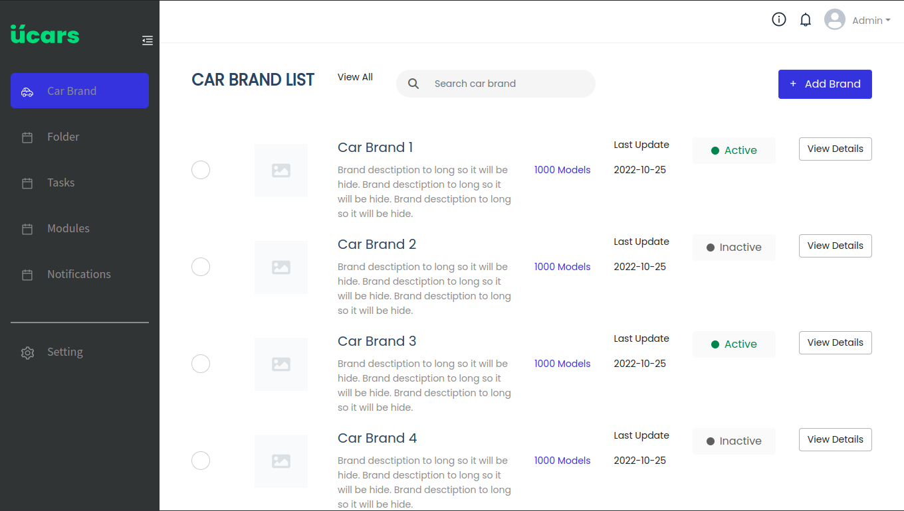
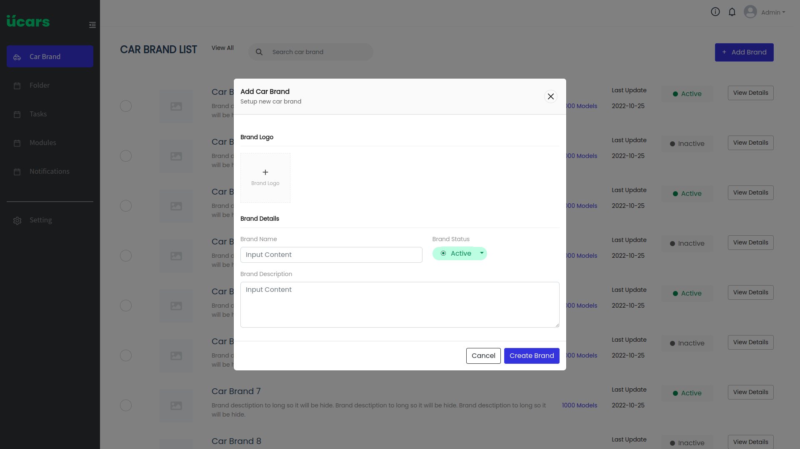
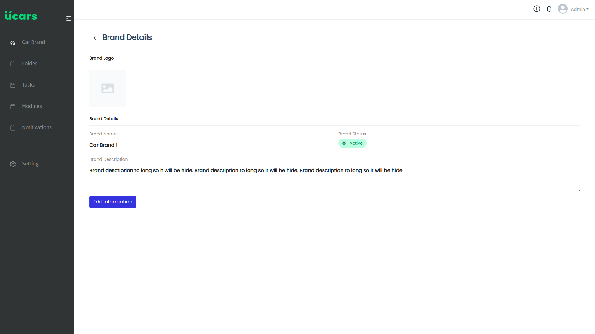
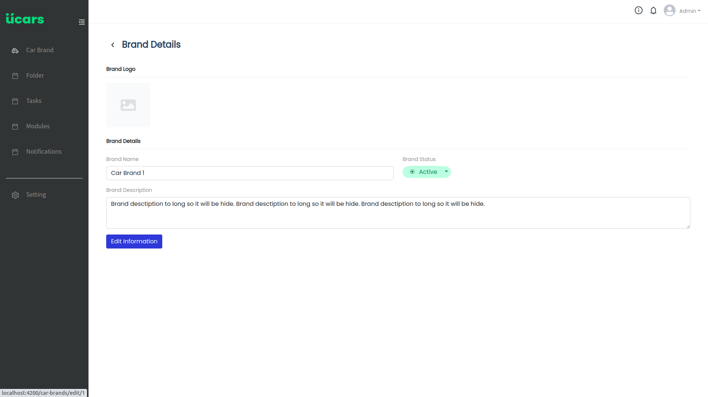

# UCars

Cars Management System.

## Features

- [ ] List Car brand
- [ ] Search Car brand
- [ ] Add a brand
- [ ] Get a brand detail
- [ ] Update brand detail
- [ ] Delete brand detail

## Technical Stack

### Front-end

- NodeJS 16.x
- Typescript
- Angular 13+

### Backend

- Python 3, SQLAlchemy ORM and FastAPI framework.
- Postgres database.
- Docker.
- Nginx

## Screenshots

**Car Brand List page**

**Add Car Brand modal**

**Car Brand Detail page**

**Car Brand Edit page**

## Author

Make by Quan Vu
