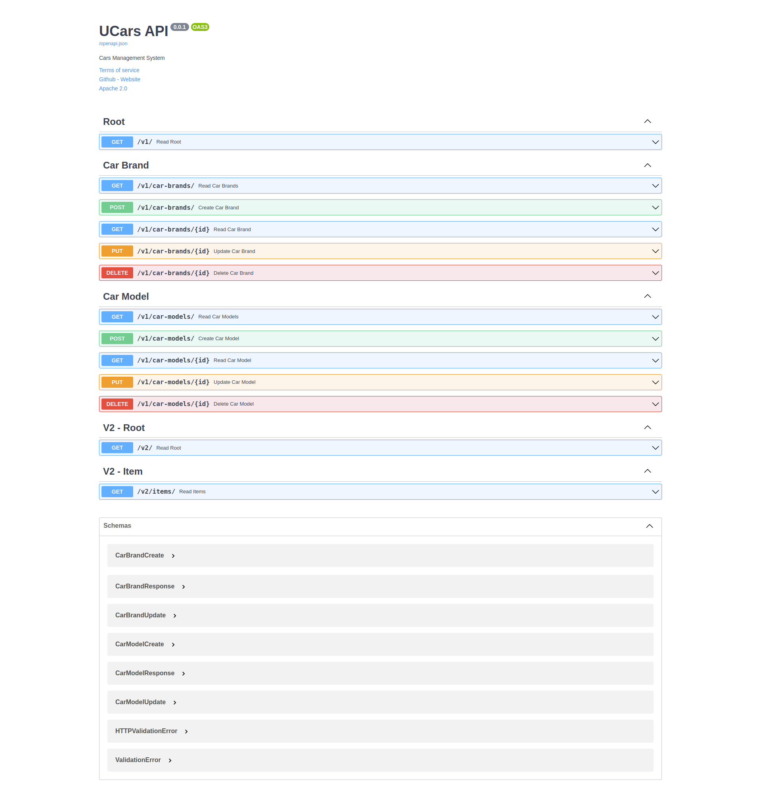

# UCars Backend

The backend Restful API for Ucars project based on Python 3.8 & FastAPI framework.

TODO

- [x] Create fresh FastAPI project.
- [x] Refactoring project structure for the scalable application.
- [ ] Unit Testing.
- [ ] Dockerization.  

**Pre-requisites:**

- Python 3.8 & Virtualenv
- SQLAlchemy ORM and 
- FastAPI framework.
- Postgres database.

## Quickstart

Step 1: Create virtualenv with python 3.8+

Move to ucars-be directory:

```shell
cd ucars-be
```

Create virtualenv

```shell
virtualenv -p python3.8 venv3.8
```

Active environment

```shell
source venv3.8/bin/activate
```

Step 2: Install Python package dependencies

```shell
pip install -r requirements.txt
```

Step 3: Start application

Start application in development mode with live reload

```shell
# Move to backend root directory
cd ucars-be

# Run application
uvicorn ucars.main:app --reload
```

Step 4: Verify application 

Open your browser this address: http://127.0.0.1:8000

```json
{"message":"Welcome to UCars!"}
```

## Screenshots



## Reference

- FastAPI: https://fastapi.tiangolo.com/
- PyTest: https://docs.pytest.org/en/7.1.x/
